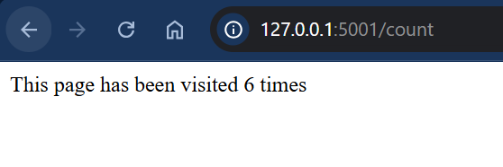

# Containers Challenge — Flask + Redis Multi-Container App

This project is a **multi-container application** built with **Docker Compose**, consisting of:
- a **Python Flask web application**
- a **Redis database** used as a key-value store

The Flask app connects to Redis to store and retrieve a persistent visit counter.

---

## What I built

### Flask Web Application
The Flask app includes two routes:
- **`/`** → displays a welcome message
- **`/count`** → increments and displays a visit count stored in Redis

### Redis Database
Redis is used to store the visit count under a key (e.g. `visits`), allowing the counter to persist outside of Flask’s memory.

### Docker + Docker Compose
Both services are containerised and managed together using Docker Compose, forming a complete multi-container application.

---

## Bonus Features Completed
- **Persistent storage for Redis** using a volume
- **Environment variables** used to configure Redis host/port in Flask
- **Scaling support** for running multiple Flask instances with Docker Compose

---

## Output Screenshots

Here are 2 images of the output:

